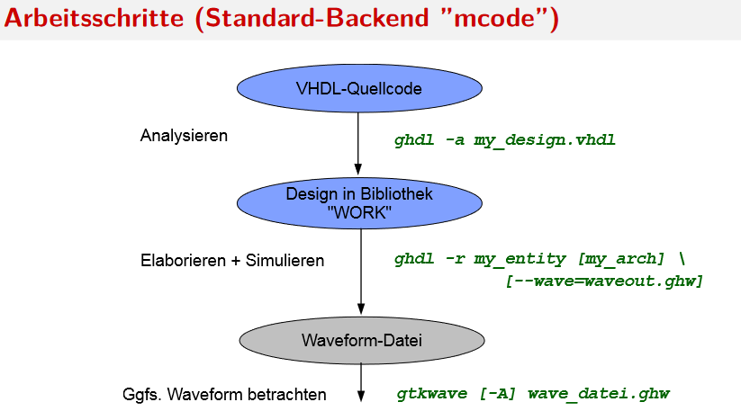
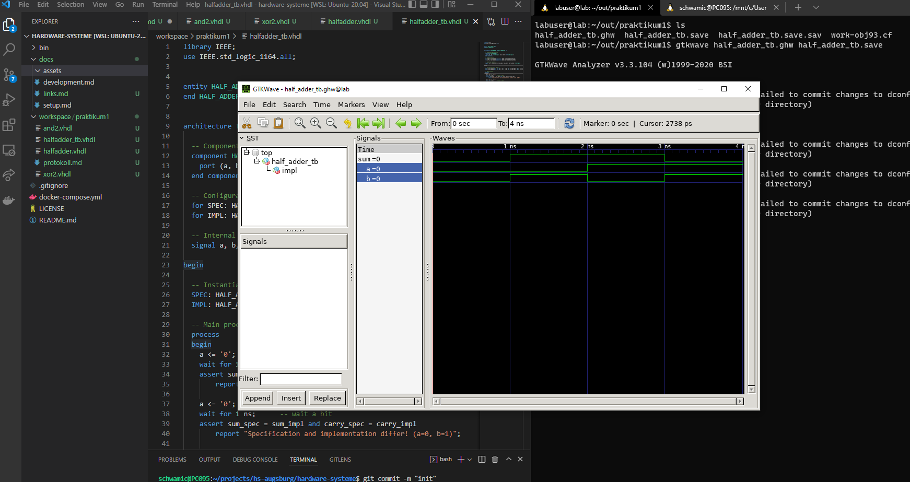
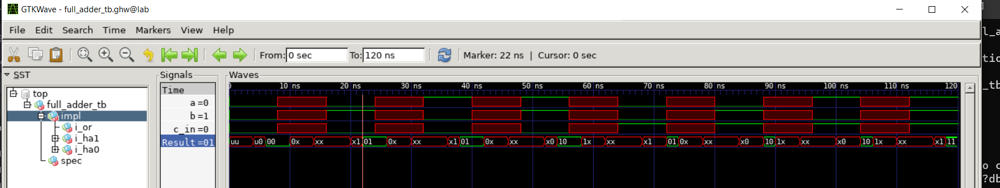

# Protokoll zum Praktikum 1

## VHDL Fingerübung und Timing-Analyse

Hochschule Augsburg \
Fakultät für Informatik \
Hardware Systeme \
Sommersemester 2022

Name: Michael Schwarz, #2141622, MIN, <michael.schwarz@hs-augsburg.de> \
Gruppe: Team 1b

---

### Aufgabe 1b)

Beschreibungsstil in diesem Praktikum: BEHAVIOR/DATAFLOW/STRUCTURE/TESTBENCH:

- `ARCHITECTURE`: Modellierung der Hardware.
  - `DATAFLOW`: Beziehungen zwischen den Signalen, inkl. Zeitverhalten (Boolsche Ausdrücke/Spezifikation).
  - `BEHAVIOR`: Eingangs-/Ausgangsverhalten einer Schaltung funktional beschrieben, inkl. Zeitverhalten (Algorithmus/Spezifikation).
  - `STRUCTURE`: Ausgabe aus der Synthese, bestehend aus System-Modulen, kein Zeitverhalten (Implementierung)
- `TESTBENCH`: Umgebung zum validieren des Entwurfs
- `ENTITY`: Schnittstellenbeschreibung (Input, Output)

Synthese-Tool: GHDL

### Aufgabe 1c)

- Analysieren: `ees-ghdl -a <entity>.vhdl`
- WORK Datei enthält:
  - `entity half_adder`
  - `entity xor2`
  - `entity and2`

### Aufgabe 1e)

- Elaburieren und Simulieren: `ees-ghdl -r half_adder_tb --wave=half_adder_tb.ghw`
- Anzeige der Signalverläufe: `gtkwave half_adder_tb.ghw half_adder_tb.save`

### Aufagbe 1f)

- Test ausführen: `ees-ghdl -r half_adder_tb testbench2 --wave=half_adder_tb.ghw`
- Beobachtung: Je nach fehlerhafte Architektur schlägt die Testbench1 oder Testbench2 fehl. Testbench1 prüft die Spezifiktaion gegen die Implikation und Testbench2 prüft direkt das Verhalten gegen konkrete Testfälle.

---

### Aufgabe 2b)

- src/fingeruebung/or2.vhdl
- src/fingeruebung/xor2.vhdl
- src/fingeruebung/and2.vhdl

### Aufgabe 2d)

- src/fingeruebung/fulladder.vhdl
- src/fingeruebung/fulladder_tb.vhdl

### Aufgabe 2f)

### Aufgabe 2g)

Damit man wirklich die Verzögerungen sieht, ist es hilfreich X-Werte zu setzen (nullen). Anahnd der roten und grünen Bereiche kann man dann die Verzögerung auslesen. Die kritischen Pfade sind die, die in der Testbench durch vorbelegte signale "manipulierte" Ergebnisse liefern, aufgrund deren Verzögerung.

Im Fulladder gibt es zwei Pfade mit maximal 8ns. Zum Beispiel mit a=0, b=0 c=1.

Herleitung: Jedes Gutter hat eine bestimmte Verzögerung. Folgt man dem Pfad in dem Schaubild kann man die Verzögerunen ausrechnen. Es empfiehlt sich kritische Pfade zusätzlich der Testbench hinzuzufügen.

Die Taktrate wird anhand des längsten Durchlaufs bestimmt.

### Aufgabe 2i)

- src/fingeruebung/fulladder_tb.vhdl

---

### Aufgabe 3b)c)

Signale haben einen Wert pro Takt. Variablen haben einen Wert pro Zeile im Sourcecode.
