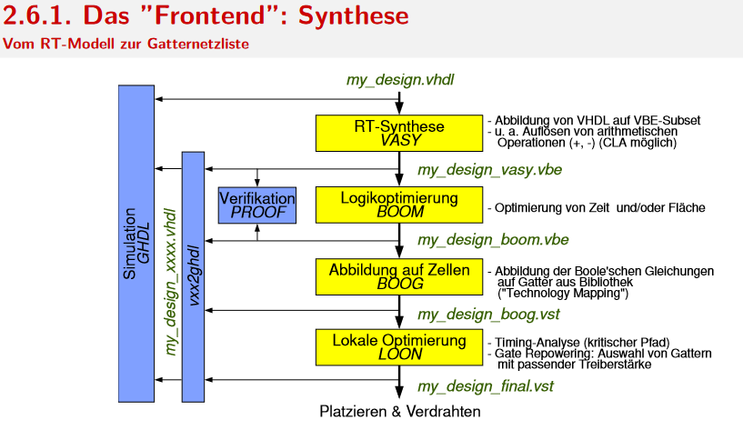
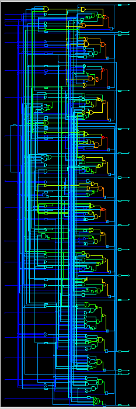
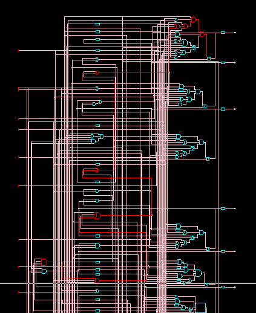
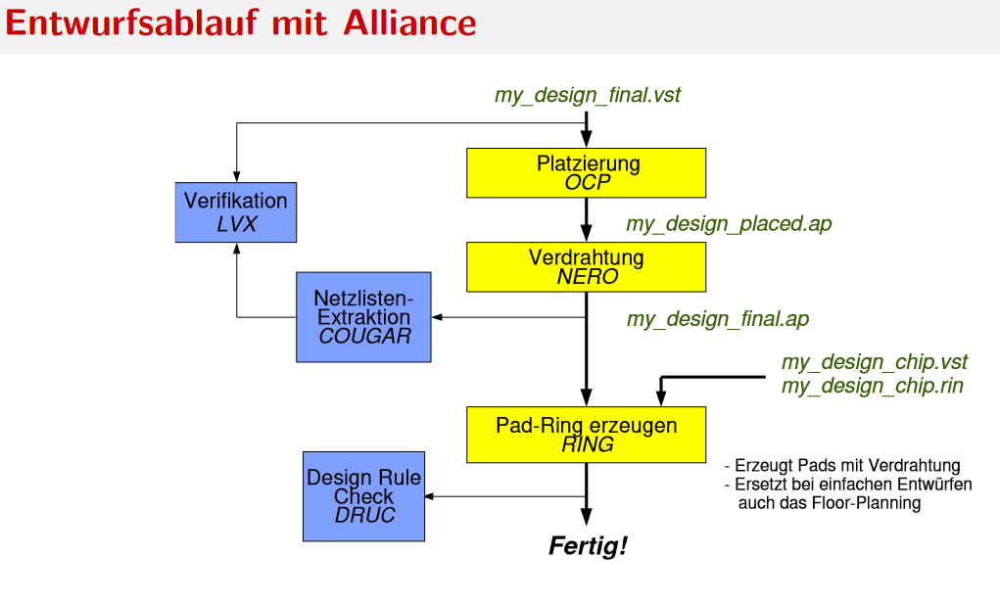
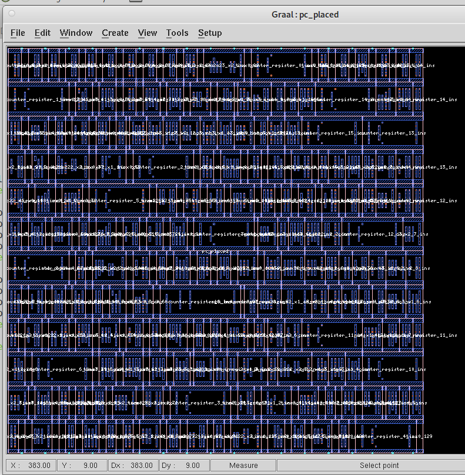
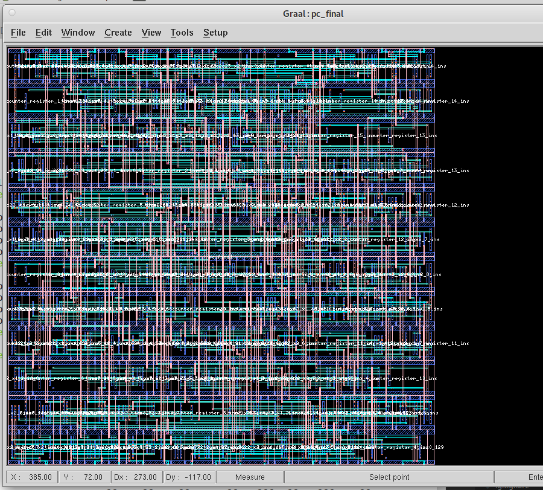

# Protokoll zum Praktikum 2

## Der VISCY-Prozessor – Teil 1

Hochschule Augsburg \
Fakultät für Informatik \
Hardware Systeme \
Sommersemester 2022

Name: Michael Schwarz, #2141622, MIN, <michael.schwarz@hs-augsburg.de> \
Gruppe: Team 1b

---

### Vorbereitung

Beschreibungsstil in diesem Praktikum: RTL/TESTBENCH. RTL (=register-transfer-level): Syntesierbares VHDL, das automatisch in eine Struktur umgesetz werden kann. Keine modellierung von Zeit ("after"-Klause").

Alliance CAD-Tool (=computer-aides design): Einsatz von Computern zur Unterstützung bei der Erstellung, Änderung, Analyse oder Optimierung eines Designs.

- Analysieren: `ees-ghdl -a <entity>.vhdl`
- [pc.vhdl](../../../src/viscy-processor/src/hdl/pc.vhdl)
- [pc_testbench.vhdl](../../../src/viscy-processor/src/hdl/pc_testbench.vhdl)

### Aufgabe 1 (Frontend)

- VBE (VHDL Behavioral Subset)
- VST (VHDL Structural Subset)

### Aufagbe 1a)

- Elaburieren und Simulieren: `ees-ghdl -r pc_testbench --wave=pc_testbench.ghw`
- Anzeige der Signalverläufe: `gtkwave pc_testbench.ghw pc_testbench.save`

//TODO Screenshot der GtkWave

### Aufgabe 1b)

- RT-Synthese: VASY (pc + regile)
  1. Analyse und Synthese: `vasy -a -p pc pc_vasy` -> `pc_vasy.vbe`
  2. Überprüfung der generierten Datei:
     - Konvertierung in VHDL mit `vxx2ghdl`: `vxx2ghdl pc_vasy.vbe` -> `pc_vasy.vhdl`
     - Testbench anpassen, sodass die `pc_vasy` entity genutzt wird
     - Simulation mit GHDL: Analyse + Simulation + Waveform anschauen
- Logikoptimierung (Zeit/Fläche): BOOM
   1. Synthese: `boom pc_vasy pc_boom` -> `pc_boom.vbe`
   2. Konvertierung in VHDL mit `vxx2ghdl` und Simulation mit GHDL
      - //TODO -> Hier funktionieren die Tests nicht mehr (regfile und pc)
   3. Formale Verifikation mit PROOF: `proof pc_boom pc_vasy`
- Abbildung auf Zellbibliothek (Gutter): BOOG
   1. Synthese: `boog pc_boom pc_boog` -> `pc_boog.xsc`
   2. Gatter-Schaltung mit dem Tool `XSCH` anschauen: `xsch &` + datei öffnen über GUI
- Lokale Optimierung und Analyse: LOON
   1. Synthese: `loon -x 1 pc_boog pc_final` (-x 0 = kritischer Pfad) -> `pc_final.vst`
   2. MIT XSCH Tool anschauen
   3. [pc_final.vst](../../../src/viscy-processor/src/hdl/pc_final.vst)
   4. Mit `vxx2ghdl` konvertieren möglich -> hierzu gibt es einen Bug, der in den Aufgabenblättern erklärt und gelöst wird.

### Aufgabe 1c)

//TODO
 VHDL Datei kann erzeugt werden, läuft aber nicht mit der Testbench. ->  warning [...] is not bound. (pc + regfile)

### Aufgabe 1d)

1. Gab es Warnungen oder Fehlermeldungen?
   - (a) `vxx2ghdl pc_final.vst`: Error 19 line 2373 in file pc_final :label `mbk_buf_not_aux37` already used. Note that errors might also be due to unsupported statements.
   - (b) Warnung `... is not bound` beim ausführen der Tests mit `pc_final`
2. Welche Änderungen im Code waren für die Synthese nötig?
   - (a) elif Anweisung vereinfacht
   - (a) Alle Zuweisung via `std_logic_vector` und ggf. `unsigned`
   - (a) FIX siehe Blatt2 Hinweis: 5 Stellen waren betroffen.
   - (b) //TODO
3. Entspricht die Struktur dem, was Sie als Syntheseergebis erwartet haben?
//TODO Auf was sollte man da achten?
4. Wie viele Flipflops wurden erzeugt? Entspricht die Zahl Ihren Erwartungen?
//TODO Wo und wie schaut man das nach?
5. Wie groß ist die maximale Signalverzögerung in Ihrer Schaltung?
//TODO Via XSCH kann man sich den kritischen Pfad anzeigen, wo steht aber die maximale Verzögerung?

### Aufgabe 2 (Backend)

- AP: Layout (symbolisches)
- RDS (=Rectangle Data Structure): Layout (real)
- RIN: Lage von Anschluss-Pads
- AL: Netzlist (Alternative zu VST)

### Aufgabe 2a)

- Platzieren: `ocp -ring pc_final pc_placed` -> `pc_placed.ap`
- //Error regfile

### Aufgabe 2b)

- Verdratung: `nero -p pc_placed pc_final pc_final` -> `pc_final.ap`
- Layout betrachten: `graal`
- //Error regfile

### Aufgabe 2c)

- Graal:
  - pc_placed.ap:
    
  - pc_final.ap:
    
  - //Error regfile
