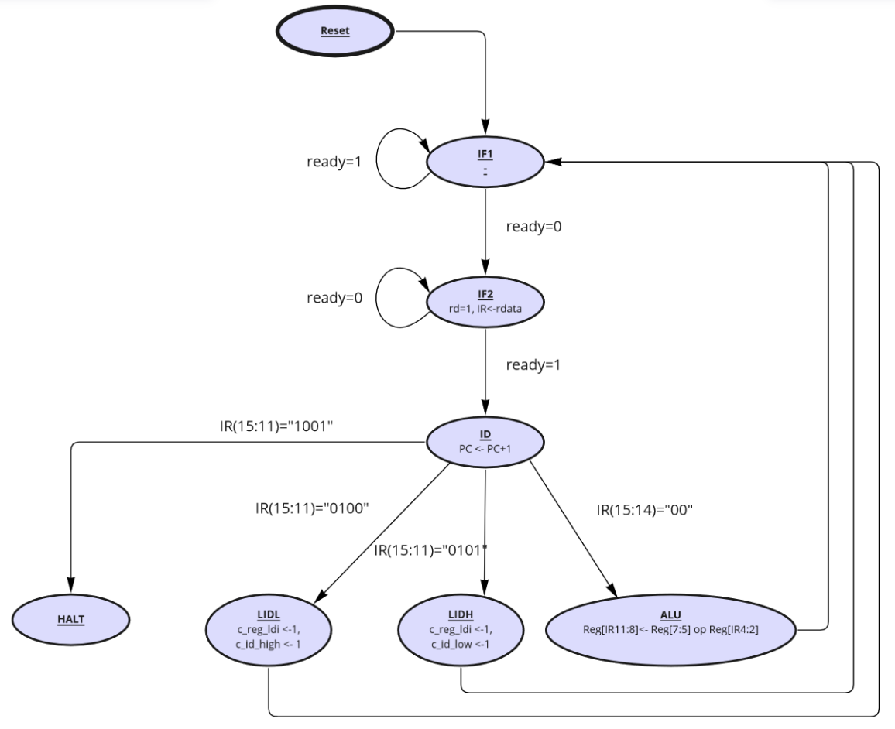

# Protokoll zum Praktikum 3

## Der VISCY-Prozessor – Teil 2

Hochschule Augsburg \
Fakultät für Informatik \
Hardware Systeme \
Sommersemester 2022

Name: Michael Schwarz, #2141622, MIN, <michael.schwarz@hs-augsburg.de> \
Gruppe: Team 1b

---

### Vorbereitung

